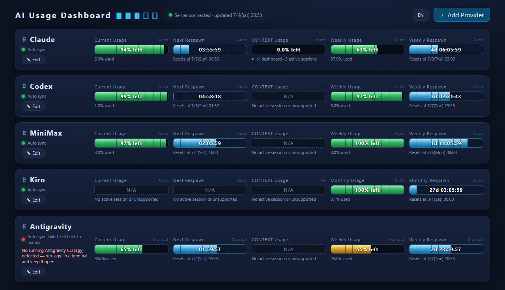
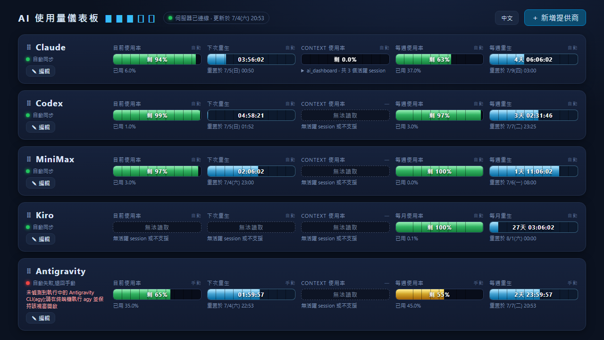

# AI Usage Dashboard

English | [繁體中文](README.md)

A locally-run AI usage dashboard: one row per AI provider, showing current usage,
time to next reset, context usage, and weekly/monthly usage as retro HP bars.
Supports automatic sync for Claude / Codex / MiniMax / Antigravity / Kiro
(Antigravity requires the `agy` CLI to be kept running in a terminal;
Kiro requires `kiro-cli` to be installed and logged in).

Zero runtime dependencies — the frontend is a single `index.html`, and the
`server.js` server uses only Node.js built-in modules, so **no `npm install`
is required** to run it. The server only binds to `127.0.0.1` and is never
exposed externally. The UI supports switching between Traditional Chinese
and English, defaulting to your browser's language.




## Quick Start

The only prerequisite is [Node.js](https://nodejs.org/) (LTS recommended).

Download this project (`git clone` or download the ZIP and extract it), then
from the project folder run the script for your OS:

### Windows

Double-click `start.bat`, or run it from a terminal:

```
start.bat
```

### macOS

Right-click `start.command` in Finder → Open (on first run, Gatekeeper will
block it — right-click once to allow, or run
`xattr -d com.apple.quarantine start.command` in a terminal to remove the
quarantine flag).

You can also run it directly from a terminal:

```bash
./start.command
```

### Linux

Run it from a terminal:

```bash
./start.sh
```

Once started, your browser will automatically open to `http://127.0.0.1:3789`.
If it doesn't open automatically, just visit that address manually.

## Secrets

The MiniMax API Key and other secrets are only used locally: they're encrypted
with AES-256-GCM and stored in `config.json`. The encryption key is derived
from your **local hardware ID** (Windows: BIOS serial number + MachineGuid;
macOS: `IOPlatformUUID`; Linux: `/etc/machine-id`). This means `config.json`
is bound to a single machine and cannot be decrypted if copied to another
computer — there's no need (and you shouldn't) upload or share `config.json`.

## Development / Testing

Only needed if you want to run the Playwright E2E tests:

```bash
npm install
npx playwright install chromium
```
